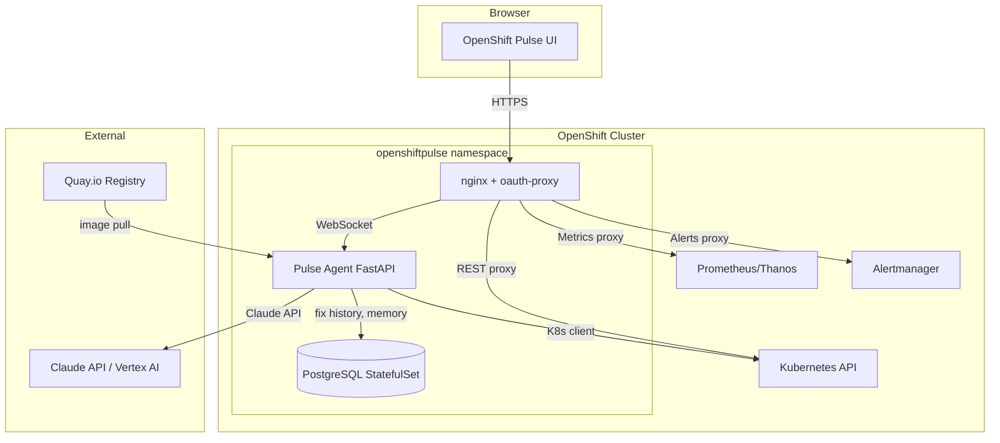
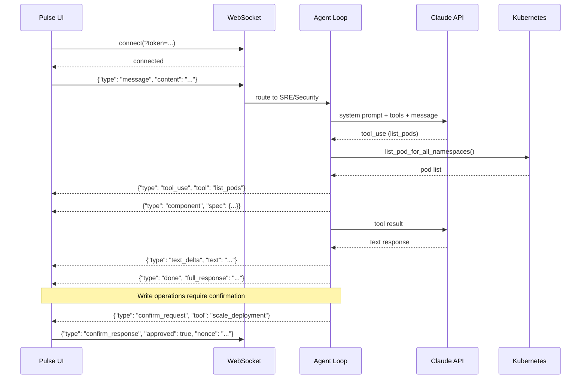
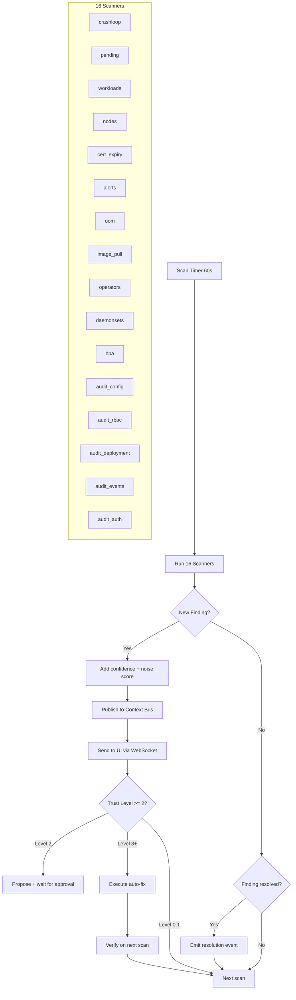
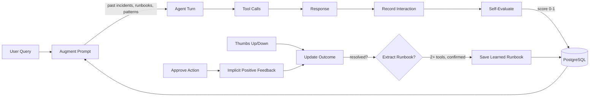
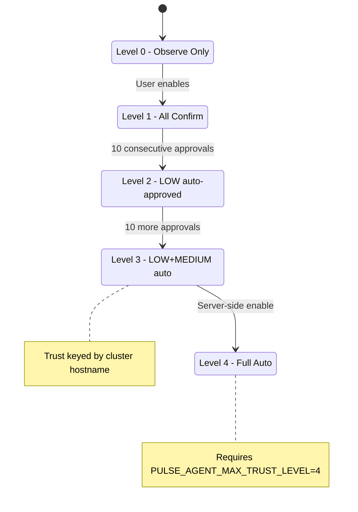

# Pulse Agent Architecture

## System Overview

```mermaid
graph TB
    subgraph "Browser"
        UI[OpenShift Pulse UI]
    end

    subgraph "OpenShift Cluster"
        subgraph "openshiftpulse namespace"
            NGINX[nginx + oauth-proxy]
            AGENT[Pulse Agent FastAPI]
            PG[(PostgreSQL StatefulSet)]
        end
        K8S[Kubernetes API]
        PROM[Prometheus/Thanos]
        AM[Alertmanager]
    end

    subgraph "External"
        CLAUDE[Claude API / Vertex AI]
        QUAY[Quay.io Registry]
    end

    UI -->|HTTPS| NGINX
    NGINX -->|WebSocket| AGENT
    NGINX -->|REST proxy| K8S
    NGINX -->|Metrics proxy| PROM
    NGINX -->|Alerts proxy| AM
    AGENT -->|Claude API| CLAUDE
    AGENT -->|K8s client| K8S
    AGENT -->|fix history, memory| PG
    QUAY -->|image pull| AGENT
```

## WebSocket Protocol

```mermaid
sequenceDiagram
    participant UI as Pulse UI
    participant WS as WebSocket
    participant Agent as Agent Loop
    participant Claude as Claude API
    participant K8s as Kubernetes

    UI->>WS: connect(?token=...)
    WS-->>UI: connected

    UI->>WS: {"type": "message", "content": "..."}
    WS->>Agent: route to SRE/Security
    Agent->>Claude: system prompt + tools + message
    Claude-->>Agent: tool_use (list_pods)
    Agent->>K8s: list_pod_for_all_namespaces()
    K8s-->>Agent: pod list
    Agent-->>UI: {"type": "tool_use", "tool": "list_pods"}
    Agent-->>UI: {"type": "component", "spec": {...}}
    Agent->>Claude: tool result
    Claude-->>Agent: text response
    Agent-->>UI: {"type": "text_delta", "text": "..."}
    Agent-->>UI: {"type": "done", "full_response": "..."}

    Note over UI,Agent: Write operations require confirmation
    Agent-->>UI: {"type": "confirm_request", "tool": "scale_deployment"}
    UI->>WS: {"type": "confirm_response", "approved": true, "nonce": "..."}
```

## Monitor Scan Loop

```mermaid
flowchart TD
    START[Scan Timer 60s] --> SCANNERS
    SCANNERS[Run 16 Scanners] --> DEDUP{New Finding?}
    DEDUP -->|Yes| ENRICH[Add confidence + noise score]
    DEDUP -->|No| STALE{Finding resolved?}
    STALE -->|Yes| RESOLUTION[Emit resolution event]
    STALE -->|No| NEXT[Next scan]
    ENRICH --> CTXBUS[Publish to Context Bus]
    CTXBUS --> SEND[Send to UI via WebSocket]
    SEND --> AUTOFIX{Trust Level >= 2?}
    AUTOFIX -->|Level 2| PROPOSE[Propose + wait for approval]
    AUTOFIX -->|Level 3+| EXECUTE[Execute auto-fix]
    AUTOFIX -->|Level 0-1| NEXT
    EXECUTE --> VERIFY[Verify on next scan]
    VERIFY --> NEXT
    RESOLUTION --> NEXT

    subgraph "16 Scanners"
        S1[crashloop]
        S2[pending]
        S3[workloads]
        S4[nodes]
        S5[cert_expiry]
        S6[alerts]
        S7[oom]
        S8[image_pull]
        S9[operators]
        S10[daemonsets]
        S11[hpa]
        S12[audit_config]
        S13[audit_rbac]
        S14[audit_deployment]
        S15[audit_events]
        S16[audit_auth]
    end
```

## Memory Learning Loop

```mermaid
flowchart LR
    QUERY[User Query] --> AUGMENT[Augment Prompt]
    AUGMENT --> |past incidents, runbooks, patterns| AGENT[Agent Turn]
    AGENT --> TOOLS[Tool Calls]
    TOOLS --> RESPONSE[Response]
    RESPONSE --> RECORD[Record Interaction]
    RECORD --> SCORE[Self-Evaluate]
    SCORE --> |score 0-1| DB[(PostgreSQL)]

    FEEDBACK[Thumbs Up/Down] --> OUTCOME[Update Outcome]
    OUTCOME --> |resolved?| RUNBOOK{Extract Runbook?}
    RUNBOOK -->|2+ tools, confirmed| SAVE[Save Learned Runbook]
    SAVE --> DB

    CONFIRM[Approve Action] --> IMPLICIT[Implicit Positive Feedback]
    IMPLICIT --> OUTCOME

    DB --> AUGMENT
```

## Trust Level Progression

```mermaid
stateDiagram-v2
    [*] --> L0_Observe
    L0_Observe --> L1_Confirm: User enables
    L1_Confirm --> L2_Batch: 10 consecutive approvals
    L2_Batch --> L3_Bounded: 10 more approvals
    L3_Bounded --> L4_Autonomous: Server-side enable

    L0_Observe: Level 0 - Observe Only
    L1_Confirm: Level 1 - All Confirm
    L2_Batch: Level 2 - LOW auto-approved
    L3_Bounded: Level 3 - LOW+MEDIUM auto
    L4_Autonomous: Level 4 - Full Auto

    note right of L3_Bounded: Trust keyed by cluster hostname
    note right of L4_Autonomous: Requires PULSE_AGENT_MAX_TRUST_LEVEL=4
```
