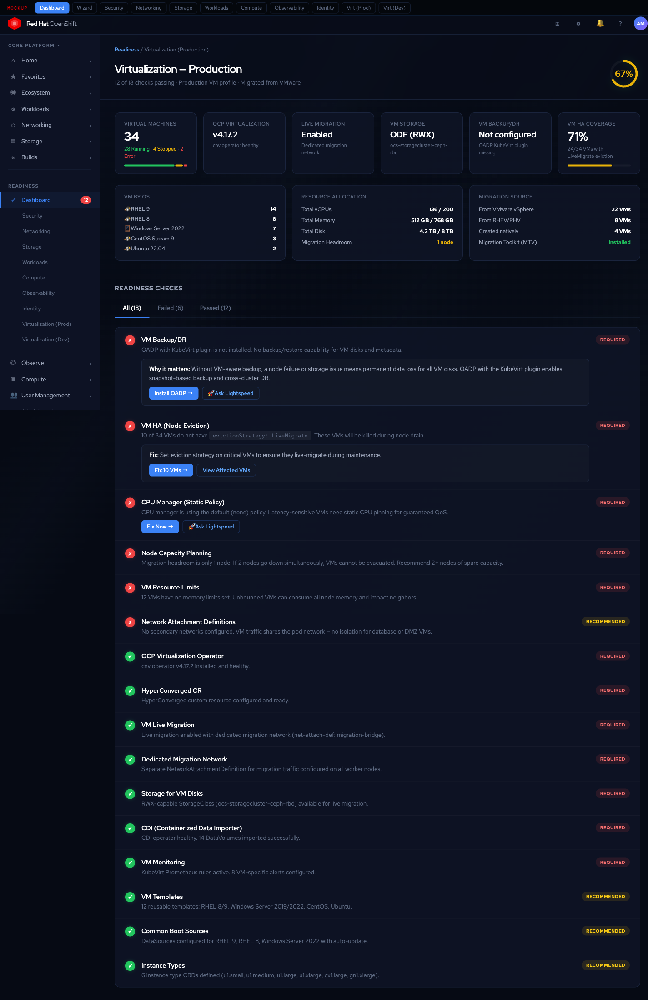
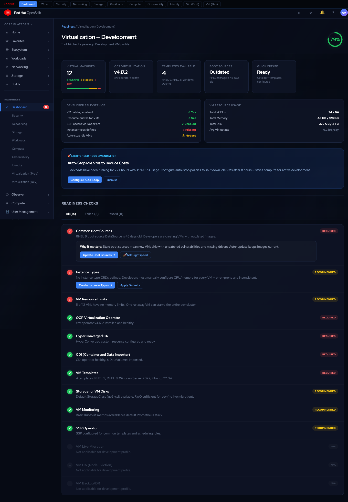

# Feature Proposal: OpenShift Console Readiness & Best Practices Platform

## Executive Summary

OpenShift customers consistently struggle with one question: **"Is my cluster production-ready?"**

The OCP console shows cluster health — pods running, operators available, nodes ready — but it doesn't tell customers whether their cluster follows best practices, whether it's configured correctly for their workload profile, or what they should do next. More critically, most customers use a fraction of the platform they're paying for and have no way to discover what they're missing.

This proposal adds a **Readiness & Best Practices Platform** to the OCP console: profile-aware readiness scoring across 7 domains (56 checks), organization-defined custom checklists, and OpenShift Lightspeed integration that analyzes cluster usage to recommend platform capabilities customers should adopt.

---

## Why This Matters

**1. "Day 2 Cliff"** — Clusters go live without readiness validation. No network policies, default SCCs, missing monitoring, no encryption at rest. These become support tickets or security incidents.

**2. No unified compliance view** — Checking best practices requires navigating dozens of console pages. No single view says "your security posture is 72% — here's what's missing."

**3. One-size-fits-all guidance** — A production cluster needs HA and encryption. A dev cluster doesn't. Edge clusters are single-node. The same checklist can't serve all of them.

**4. No value discovery** — The console shows what IS, not what SHOULD BE. Customers running ArgoCD don't get prompted to adopt Tekton. Customers with service mesh don't get told to enable mTLS. The platform has capabilities customers are paying for but never find.

**5. No way to codify org standards** — Every organization has internal requirements (labels, operators, node configs) that can't be automated as console checks today.

---

## Value Proposition

| | Customer Impact | Business Impact |
|---|---|---|
| **Risk reduction** | Catch misconfigurations before they become incidents or compliance violations | Fewer P1 escalations, lower support cost |
| **Faster Day 2** | Guided checklists replace weeks of tribal knowledge with hours of automation | Faster time-to-production = faster expansion |
| **Platform discovery** | Every check and AI recommendation teaches customers about capabilities they're paying for but not using | Drives adoption of ACM, ACS, RHOAI, Service Mesh, Tekton, OADP — each adopted capability deepens investment |
| **Org knowledge capture** | Custom checklists codify tribal knowledge; new team members inherit standards automatically | Increases switching costs — organizations encode their processes into the platform |
| **Guided remediation** | "Fix Now" buttons navigate to the right page, pre-fill YAML, or trigger operator installs — checks become a workbench, not just a report card | Faster resolution = fewer escalations, higher self-service rate |
| **Compliance mapping** | Each check maps to SOC2, FedRAMP, PCI-DSS, HIPAA controls — one-click audit evidence export replaces weeks of manual gathering | Opens regulated-industry segments (finance, healthcare, government); competitive moat |
| **Readiness-as-code** | Export entire readiness config as YAML — version in Git, bootstrap new clusters, promote across environments | GitOps for governance; fleet consistency without manual drift correction |
| **Support deflection** | "Why it matters" on every check educates in-context; Lightspeed handles remediation questions | Reduces repeat contacts and ticket volume |

### Competitive Position

| Platform | What They Have | What They Lack |
|----------|---------------|----------------|
| **Rancher/SUSE** | Production checklist docs, CIS benchmark scanning, NeuVector | No unified scoring dashboard, no profiles, no AI, no custom checks |
| **Tanzu/Broadcom** | MachineHealthCheck, OSS Health Assessment, Tanzu Labs (professional services) | Fragmented tools, no integrated dashboard, no profiles, no custom checks |
| **AWS EKS** | Cluster Insights (upgrade readiness), hardeneks CLI | Console only shows upgrade readiness, no domain scoring, no custom checks |
| **Azure AKS** | Azure Advisor (generic recommendations), community AKS Checklist | Generic Azure tool (not K8s-native), no profiles, no custom CRDs |

**Our differentiator:** No platform combines profile-aware scoring + domain audit panels + custom check CRDs + AI-powered usage recommendations in a single integrated console experience.

### Tier & Insights Opportunity
- Basic readiness checks in all tiers; AI recommendations and custom checklists as premium features
- Anonymized fleet-wide readiness data reveals which checks fail most often — informs docs, defaults, and product investment

---

## Feature Overview

An enhancement to the existing OCP console (not a standalone plugin):

- **Readiness Dashboard** — Overall score + per-domain scores with drill-down
- **7 Domain Overview Pages** — Security, Networking, Storage, Workloads, Compute, Observability, Identity — each with metric cards and audit checklists
- **7 Cluster Profiles** — Production, Development, Edge/SNO, AI/ML, Multi-Tenant, Disconnected, HPC — each tailors which checks are required, recommended, or N/A
- **Guided Remediation** — "Fix Now" buttons that navigate to the right console page, pre-fill YAML, or trigger operator installs
- **Custom Checklists** — `ReadinessCheck` CRD for organization-defined checks, distributed via ACM policies
- **Compliance Mapping** — Each check maps to SOC2, FedRAMP, PCI-DSS, HIPAA controls with one-click audit export
- **Readiness-as-Code** — Export/import `ReadinessConfig` YAML for GitOps governance and fleet bootstrapping
- **Lightspeed Advisor** — AI-powered recommendations based on cluster usage patterns

```
┌──────────────────────────────────────────────────────────┐
│  OCP Console (Administrator View)                        │
│  ┌────────────────────────────────────────────────────┐  │
│  │  Readiness Dashboard                               │  │
│  │  ┌──────────┐ ┌──────────┐ ┌──────────┐           │  │
│  │  │ Overall  │ │ Cluster  │ │ Compliance│           │  │
│  │  │ Score    │ │ Profile  │ │ SOC2: 85% │           │  │
│  │  │  78%     │ │Production│ │ PCI:  72% │           │  │
│  │  └──────────┘ └──────────┘ └──────────┘           │  │
│  │                                                    │  │
│  │  Domain Scores                                     │  │
│  │  ┌─────┐┌─────┐┌─────┐┌─────┐┌─────┐┌─────────┐ │  │
│  │  │Sec  ││Net  ││Store││Work ││Obs  ││+ Custom │ │  │
│  │  │ 85% ││ 70% ││ 90% ││ 65% ││ 80% ││  3 orgs │ │  │
│  │  └─────┘└─────┘└─────┘└─────┘└─────┘└─────────┘ │  │
│  │                                                    │  │
│  │  ┌─ Failing Check ────────────────────────────┐   │  │
│  │  │ ✗ Encryption at Rest       [Fix Now] [Ask] │   │  │
│  │  │   etcd unencrypted ──→ opens API Server pg │   │  │
│  │  └────────────────────────────────────────────┘   │  │
│  │                                                    │  │
│  │  ┌─ Lightspeed Advisor ───────────────────────┐   │  │
│  │  │ "Based on your GitOps usage, consider       │   │  │
│  │  │  adopting Tekton + GitOps Promoter for      │   │  │
│  │  │  automated promotion pipelines."            │   │  │
│  │  └────────────────────────────────────────────┘   │  │
│  │                                                    │  │
│  │  ┌─ Readiness-as-Code ────────────────────────┐   │  │
│  │  │ [Export Config]  [Import]  [View in Git ↗]  │   │  │
│  │  └────────────────────────────────────────────┘   │  │
│  └────────────────────────────────────────────────────┘  │
└──────────────────────────────────────────────────────────┘
```

---

## Proposed UI Mockups

PatternFly 6 (Compass theme), integrated into OCP console with sidebar navigation:

### Readiness Dashboard


### Cluster Profile Wizard


### Security Overview + Audit


### Networking Overview + Audit


### Storage Overview + Audit


### Workloads Overview + Audit


### Compute Overview + Audit


### Observability Overview + Audit


### Identity & Access Overview + Audit


### Virtualization (Production) Overview + Audit
VM inventory (34 VMs by OS), resource allocation, migration source tracking, live migration status, HA coverage, backup/DR status. 18 checks with "Fix Now" for eviction strategy and OADP install:


### Virtualization (Development) Overview + Audit
Developer self-service readiness, boot source freshness, quick-create status, idle VM detection. Lightspeed recommendation for auto-stop policies. N/A checks greyed out (live migration, HA, DR not needed in dev):


---

## Cluster Profiles

Administrators select (or auto-detect) a profile that tailors every check's severity:

| Profile | Use Case | Required | Recommended | Key Differentiators |
|---------|----------|----------|-------------|-------------------|
| **Production** | Full hardening | 48 | 14 | HA, encryption, TLS, PDBs, backups, quotas |
| **Development** | Fast iteration | 12 | 20 | Identity + quotas required; HA, encryption N/A |
| **Virtualization (Prod)** | Production VMs | 38 | 16 | OCP Virt operator, live migration, HA for VMs, storage for VM disks, backup/DR |
| **Virtualization (Dev)** | Dev/test VMs | 14 | 18 | OCP Virt operator, basic storage; live migration, HA, DR not required |
| **Edge / SNO** | Resource-constrained | 15 | 10 | Workload partitioning, local storage; HA N/A |
| **AI/ML** | GPU workloads | 22 | 16 | GPU operator, RHOAI, node feature discovery |
| **Multi-Tenant** | Strong isolation | 30 | 12 | Network policies + quotas + RBAC per tenant |
| **Disconnected** | Air-gapped | 18 | 8 | Mirror registry, internal catalogs, CA trust |
| **HPC** | Low-latency batch | 16 | 10 | CPU pinning, NUMA, hugepages, SR-IOV |

### Virtualization Profiles — Production vs Development

Clusters running OpenShift Virtualization have fundamentally different needs than container-only clusters. VM workloads need dedicated storage backends, live migration infrastructure, and hardware-aware scheduling that containers don't require. The two VM profiles address opposite ends of the spectrum:

**Virtualization (Production)** — Running business-critical VMs migrated from VMware, Hyper-V, or RHEV. These are the workloads customers can't afford to lose — databases, legacy apps, stateful services.

| Check | Description | Prod VM | Dev VM |
|-------|-------------|---------|--------|
| OCP Virtualization Operator | cnv operator installed and healthy | Req | Req |
| HyperConverged CR | HyperConverged custom resource configured | Req | Req |
| VM Live Migration | Live migration enabled and network configured (dedicated migration network) | Req | N/A |
| VM HA (node eviction) | `evictionStrategy: LiveMigrate` on critical VMs | Req | N/A |
| Dedicated Migration Network | Separate network for migration traffic (avoids saturating workload network) | Req | N/A |
| Storage for VM Disks | RWX-capable StorageClass available (ODF, NFS, or equivalent) for live migration | Req | Rec |
| CDI (Containerized Data Importer) | CDI operator healthy for VM image import | Req | Req |
| VM Backup/DR | OADP with KubeVirt plugin for VM backup/restore | Req | N/A |
| CPU Manager (static policy) | Static CPU manager for guaranteed QoS on latency-sensitive VMs | Req | N/A |
| Node Capacity Planning | Sufficient memory/CPU headroom for VM live migration (at least 1 node worth of spare capacity) | Req | N/A |
| VM Resource Limits | CPU/memory limits set on all VMs | Req | Rec |
| Network Attachment Definitions | Secondary networks (Multus/bridge/SR-IOV) for VM traffic isolation | Rec | N/A |
| VM Monitoring | VM-specific Prometheus rules and Grafana dashboards (KubeVirt metrics) | Req | Rec |
| GPU Passthrough | GPU/vGPU configured for VMs requiring GPU (if applicable) | Rec | N/A |
| Machine Type/Instance Type | Instance type CRDs defined for standardized VM sizes | Rec | Rec |
| VM Templates | Reusable VM templates for common OS images (RHEL, Windows) | Rec | Req |
| Common Boot Sources | DataSources configured for automatic OS image updates | Rec | Req |
| SSP (Scheduling, Scale, Performance) | SSP operator configured for common templates and scheduling rules | Rec | Rec |

**Key difference:** Production VM clusters treat VMs like production databases — HA, live migration, dedicated networks, backup/DR, and capacity planning are all required. Development VM clusters treat VMs like dev containers — get the operator running, provide templates and boot sources, and let developers spin up test VMs quickly. No need for live migration or DR in dev.

**Auto-detection:** The system detects VM profiles when the `HyperConverged` CRD exists or the `kubevirt.io` API group is present. Production vs development is inferred from the base profile (3+ masters + VM = Prod VM, single-master + VM = Dev VM) and can be overridden.

**Auto-detection** uses: node topology (SNO → Edge, 3+ masters → Production), installed operators (GPU Operator → AI/ML, RHACM → Multi-cluster, OCP Virtualization → VM profiles), hardware capabilities (`nvidia.com/gpu` → AI/ML), infrastructure provider, namespace patterns, workload CRDs (`HyperConverged` → VM, `RHOAI` → AI/ML), and VM count thresholds. Administrators override at any time.

---

## Custom Checklists

Organizations define checks as `ReadinessCheck` custom resources:

```yaml
apiVersion: console.openshift.io/v1alpha1
kind: ReadinessCheck
metadata:
  name: require-cost-center-label
  namespace: openshift-config
spec:
  displayName: "Cost Center Label Required"
  description: "All deployments must have a 'cost-center' label for chargeback"
  severity: required
  check:
    type: resource-label
    resource: { apiVersion: apps/v1, kind: Deployment }
    label: cost-center
  remediation:
    description: "Add metadata.labels.cost-center to the deployment"
```

**8 check types:** `resource-label`, `resource-annotation`, `operator-installed`, `operator-version`, `resource-exists`, `resource-field`, `prometheus-query`, `script` (CEL expression).

**Sharing:** Cluster-wide via `openshift-config`, namespace-scoped for teams, fleet-wide via ACM policies.

---

## Guided Remediation

Failing checks shouldn't just report problems — they should fix them. Every check includes a remediation path:

| Remediation Type | Example | UX |
|-----------------|---------|-----|
| **Console navigation** | "Enable encryption at rest" | "Fix Now" opens the API Server config page with the relevant field highlighted |
| **Operator install** | "Install OADP for backup" | "Install" opens OperatorHub filtered to the operator, pre-selected |
| **YAML apply** | "Add NetworkPolicy to namespace" | "Apply Fix" shows a pre-filled YAML editor with the correct resource, one-click apply |
| **Lightspeed guided** | "Configure ClusterLogForwarder" | "Ask Lightspeed" opens the advisor panel with the failing check as context |

For checks that require multiple steps (e.g., setting up etcd encryption requires editing the API server config, then waiting for encryption to complete, then verifying), the remediation becomes a **mini-wizard** with progress tracking.

Checks that can be auto-remediated safely (e.g., creating a default LimitRange, adding a missing label) offer a **"Fix All"** bulk action with a dry-run preview.

---

## Compliance Framework Mapping

Every readiness check maps to industry compliance frameworks. Customers in regulated industries can view their readiness through a compliance lens:

| Check | SOC 2 | FedRAMP | PCI-DSS | HIPAA |
|-------|-------|---------|---------|-------|
| Encryption at Rest | CC6.1 (Encryption) | SC-28 (Protection at Rest) | 3.4 (Render PAN unreadable) | §164.312(a)(2)(iv) |
| Audit Log Forwarding | CC7.2 (Monitoring) | AU-6 (Audit Review) | 10.5 (Secure audit trails) | §164.312(b) |
| Identity Providers | CC6.1 (Access Control) | IA-2 (Identification) | 8.1 (Unique IDs) | §164.312(d) |
| Network Policies | CC6.6 (Boundary Protection) | SC-7 (Boundary Protection) | 1.3 (Firewall config) | §164.312(e)(1) |
| RBAC Least Privilege | CC6.3 (Role-based Access) | AC-6 (Least Privilege) | 7.1 (Limit access) | §164.312(a)(1) |
| TLS Security Profile | CC6.7 (Encryption in Transit) | SC-8 (Transmission Confidentiality) | 4.1 (Strong cryptography) | §164.312(e)(2)(ii) |

**Compliance Dashboard View:** A dedicated tab on the readiness dashboard that groups checks by framework instead of domain. Shows "SOC 2: 85% compliant (17/20 controls mapped)" — giving compliance teams a single pane for audit preparation.

**Export:** One-click compliance report generation (PDF/CSV) mapping each control to its check status, evidence, and remediation plan. Replaces weeks of manual audit evidence gathering.

---

## Readiness-as-Code

The entire readiness configuration is exportable, versionable, and bootstrappable:

```yaml
apiVersion: console.openshift.io/v1alpha1
kind: ReadinessConfig
metadata:
  name: acme-corp-production
spec:
  profile: production
  overrides:
    - check: cluster-autoscaling
      severity: required    # upgraded from recommended
    - check: service-mesh
      severity: required    # org mandate
  customChecks:
    - name: require-cost-center
      type: resource-label
      resource: { apiVersion: apps/v1, kind: Deployment }
      label: cost-center
      severity: required
    - name: require-backup-annotation
      type: resource-annotation
      resource: { apiVersion: apps/v1, kind: StatefulSet }
      annotation: backup.acme.com/schedule
      severity: recommended
  complianceFrameworks:
    - soc2
    - pci-dss
```

**Workflows enabled:**
- **Bootstrap new clusters** — `oc apply -f readiness-config.yaml` on a fresh cluster immediately applies the organization's standards
- **GitOps governance** — Store readiness configs in Git alongside cluster manifests. PR reviews for standard changes. Drift detection.
- **Fleet consistency** — ACM distributes `ReadinessConfig` as a policy. Every cluster in the fleet inherits the same standards.
- **Environment promotion** — Dev clusters use a relaxed config, staging uses production config. Promotion gates require readiness score thresholds.

---

## Lightspeed Advisor

Extends OpenShift Lightspeed's cluster interaction capabilities with readiness-specific intelligence:

1. **Usage pattern analysis** — Detects what customers are doing (ArgoCD, service mesh, GPU workloads) and recommends what they should do next
2. **"Ask Lightspeed" on every failing check** — One-click remediation guidance
3. **Proactive recommendation cards** on the Readiness Dashboard
4. **BYO Knowledge** — Organizations feed internal runbooks for org-specific recommendations

**Example recommendations:**

| Pattern Detected | Recommendation |
|-----------------|----------------|
| ArgoCD with 23 apps, no CI/CD | Adopt Tekton + GitOps Promoter for automated promotion |
| Service mesh installed, mTLS permissive | Enable strict mTLS for zero-trust networking |
| 50+ deployments, no PDBs | Add PodDisruptionBudgets for upgrade safety |
| GPU nodes at 30% utilization | GPU time-slicing or MIG partitioning |
| Multiple clusters, no ACM | RHACM for unified policy and lifecycle |
| PVs at 85% capacity | Volume expansion + alerting before full |

---

## Implementation Phases

| Phase | Release | Scope |
|-------|---------|-------|
| **Foundation** | OCP 5.1 | Dashboard, 56 checks, 7 profiles with auto-detection, domain overview pages, guided remediation (console navigation + YAML apply) |
| **Customization** | OCP 5.2 | ReadinessCheck CRD, ReadinessConfig (readiness-as-code), org-level sharing, ACM policy distribution, GitOps export/import |
| **Intelligence** | OCP 5.3 | Lightspeed Advisor, usage analysis, proactive recommendations, compliance framework mapping (SOC2, FedRAMP, PCI-DSS, HIPAA) |
| **Fleet** | OCP 5.4 | ACM hub readiness aggregation, fleet dashboard, compliance report export (PDF/CSV), environment promotion gates |

---

## Success Metrics

| Metric | Target | Source |
|--------|--------|--------|
| Readiness adoption | 60% of clusters scored within 30 days | Telemetry |
| Support deflection | 25% fewer Day 2 config tickets | Support data |
| Capability adoption | 15% increase in operator installs from recommendations | Telemetry |
| Guided remediation | 50% of failing checks remediated via "Fix Now" within 7 days | Telemetry |
| Custom check usage | 30% of enterprise customers define ≥1 check in 90 days | Telemetry |
| Readiness-as-code | 20% of enterprise customers export/import ReadinessConfig | Telemetry |
| Compliance mapping | 40% of regulated-industry customers use compliance view | Telemetry |
| Lightspeed engagement | 40% click-through on "Ask Lightspeed" | Analytics |

---

## Appendix: Domain Checklist Details

### Security (12 checks)

| Check | Description | Prod | Dev | Edge | AI/ML |
|-------|-------------|------|-----|------|-------|
| Identity Providers | OAuth configured (not kubeadmin-only) | Req | Req | Req | Req |
| Kubeadmin Removed | kubeadmin secret deleted | Req | Rec | Rec | Rec |
| TLS Security Profile | Intermediate or Modern (not Old) | Req | Rec | Req | Rec |
| Encryption at Rest | etcd encryption enabled | Req | N/A | Rec | Rec |
| Network Policies | Enforced in user namespaces | Req | Rec | N/A | Rec |
| External Secrets | External Secrets or Sealed Secrets operator | Req | Rec | Rec | Rec |
| SCC Audit | No unnecessary privileged SCCs | Req | Rec | Rec | Req |
| Pod Security Admission | Enforced (not privileged baseline) | Req | Rec | Rec | Req |
| Image Signature Verification | Container image signatures verified | Req | N/A | Req | Rec |
| ACS/StackRox Integration | Advanced Cluster Security deployed | Rec | N/A | N/A | Rec |
| Compliance Operator | OpenSCAP compliance scanning | Rec | N/A | Rec | N/A |
| Audit Log Forwarding | API audit logs sent to SIEM | Rec | N/A | Rec | Rec |

### Networking (8 checks)

| Check | Description | Prod | Dev | Edge | Multi-T |
|-------|-------------|------|-----|------|---------|
| Custom Ingress Certificate | Not using self-signed default | Req | Rec | Req | Req |
| TLS on All Routes | All routes have TLS termination | Req | Rec | Req | Req |
| Network Policy Coverage | % of namespaces with policies | Req | Rec | N/A | Req |
| Egress Restrictions | Default-deny egress in sensitive namespaces | Rec | N/A | N/A | Req |
| Service Mesh | Istio/OSSM installed for mTLS | Rec | N/A | N/A | Rec |
| NodePort Exposure | Minimize NodePort services | Req | Info | N/A | Req |
| DNS Configuration | Custom DNS resolvers | Req | Info | Req | Req |
| Ingress Controller Sharding | Multiple IngressControllers for isolation | Rec | N/A | N/A | Req |

### Storage (8 checks)

| Check | Description | Prod | Dev | Edge | AI/ML |
|-------|-------------|------|-----|------|-------|
| Default StorageClass | At least one default SC set | Req | Req | Req | Req |
| Reclaim Policy | Retain for production data | Req | N/A | Rec | Req |
| Volume Binding Mode | WaitForFirstConsumer | Req | Rec | Req | Req |
| CSI Drivers | At least one CSI driver installed | Req | Req | Req | Req |
| Volume Snapshots | VolumeSnapshot CRDs and controller | Rec | N/A | N/A | Rec |
| Storage Quotas | Per-namespace storage limits | Rec | Req | N/A | Req |
| Persistent Registry | Image registry not on emptyDir | Req | Rec | Req | Rec |
| Backup Solution | OADP or equivalent installed | Req | N/A | Rec | Req |

### Workloads (8 checks)

| Check | Description | Prod | Dev | Edge | AI/ML |
|-------|-------------|------|-----|------|-------|
| Resource Limits | All deployments have CPU/memory limits | Req | Rec | Req | Req |
| Health Probes | Liveness + readiness probes configured | Req | Rec | Req | Rec |
| Pod Disruption Budgets | PDBs on critical workloads | Req | N/A | N/A | Rec |
| Rolling Update Strategy | Not using Recreate for production | Req | N/A | N/A | Rec |
| High Restart Detection | Pods with >5 restarts | Info | Info | Info | Info |
| Replica Count | Critical deployments have 2+ replicas | Req | N/A | N/A | Rec |
| Anti-Affinity Rules | Spread across nodes/zones | Req | N/A | N/A | Rec |
| Resource Quota Enforcement | Quotas in all user namespaces | Req | Req | N/A | Req |

### Observability (6 checks)

| Check | Description | Prod | Dev | Edge | AI/ML |
|-------|-------------|------|-----|------|-------|
| Monitoring Stack | Prometheus + Alertmanager healthy | Req | Req | Req | Req |
| Log Forwarding | ClusterLogForwarder to external sink | Req | Rec | Rec | Req |
| Audit Logging | API server audit policy (not None) | Req | N/A | Rec | Req |
| Custom Alerts | At least one PrometheusRule defined | Rec | N/A | Rec | Rec |
| Dashboard Templates | Grafana dashboards for key metrics | Rec | N/A | N/A | Rec |
| Cluster Observability Operator | COO installed | Rec | N/A | N/A | Rec |

### Reliability (8 checks)

| Check | Description | Prod | Dev | Edge | AI/ML |
|-------|-------------|------|-----|------|-------|
| HA Control Plane | 3+ master nodes | Req | N/A | N/A | Req |
| Worker Availability | Minimum worker count per profile | Req | Req | N/A | Req |
| Cluster Autoscaling | ClusterAutoscaler configured | Rec | N/A | N/A | Req |
| Machine Health Checks | Auto-remediation for failed nodes | Req | N/A | N/A | Req |
| Update Channel | Stable (not candidate/fast) | Req | Rec | Req | Req |
| Cluster Up to Date | No pending updates >30 days | Req | Rec | Req | Req |
| Etcd Backup | Automated backup configured | Req | N/A | Rec | Req |
| GitOps Enabled | ArgoCD/Flux for declarative config | Rec | Rec | Rec | Rec |

### Identity & Access (6 checks)

| Check | Description | Prod | Dev | Edge | Multi-T |
|-------|-------------|------|-----|------|---------|
| RBAC Least Privilege | No unnecessary cluster-admin bindings | Req | Rec | Rec | Req |
| Service Account Audit | No SA with cluster-admin | Req | Rec | Rec | Req |
| Group-Based Access | Users assigned via groups | Rec | N/A | N/A | Req |
| Stale Binding Detection | Bindings for deleted users/SAs | Info | Info | Info | Info |
| Namespace Isolation | Per-team namespace boundaries | Rec | Rec | N/A | Req |
| Wildcard RBAC Detection | No `*` verbs or resources in roles | Req | Rec | Rec | Req |

---

## References

- [OpenShift Console Dynamic Plugin Architecture](https://github.com/openshift/enhancements/blob/master/enhancements/console/dynamic-plugins.md)
- [OpenShift Lightspeed](https://www.redhat.com/en/technologies/cloud-computing/openshift/lightspeed)
- [Lightspeed Console Plugin](https://github.com/openshift/lightspeed-console)
- [Red Hat AI Platform (RHAE)](https://www.redhat.com/en/about/press-releases/red-hat-delivers-accessible-open-source-generative-ai-innovation-red-hat-enterprise-linux-ai)
- [InstructLab / Granite Models](https://www.redhat.com/en/topics/ai/what-are-granite-models)
