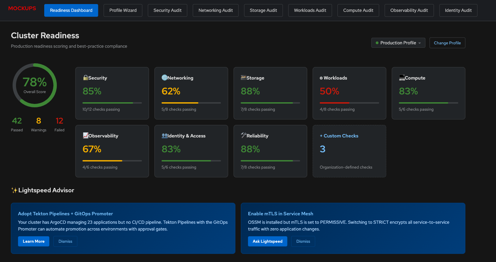
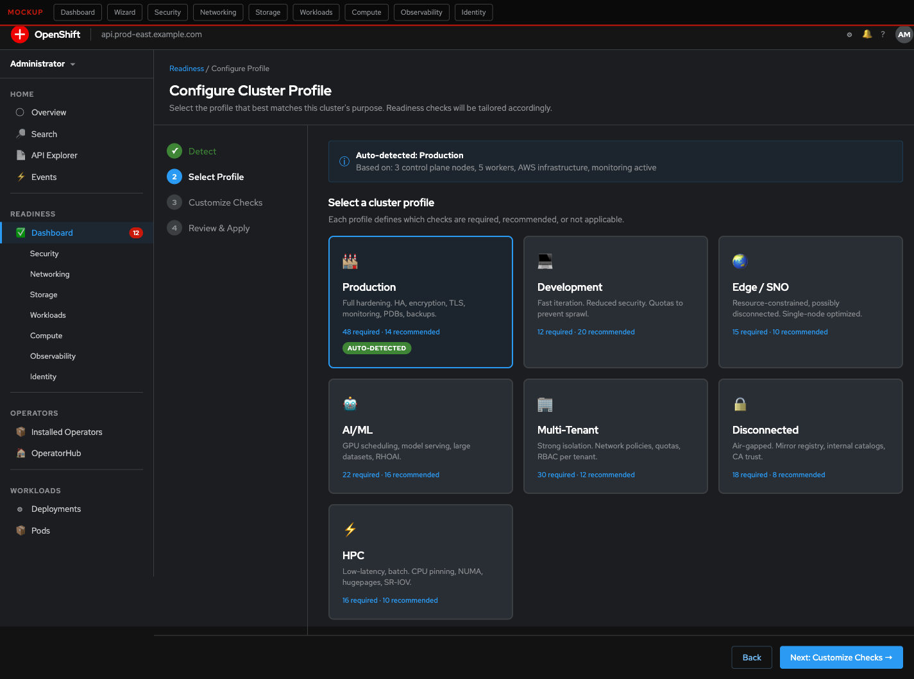
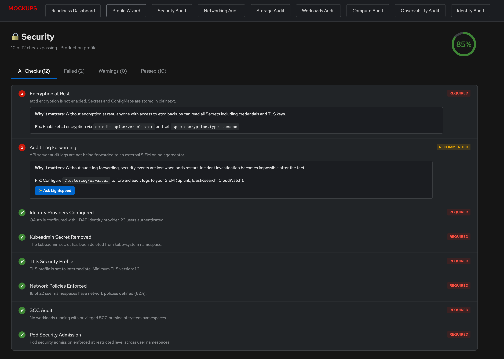
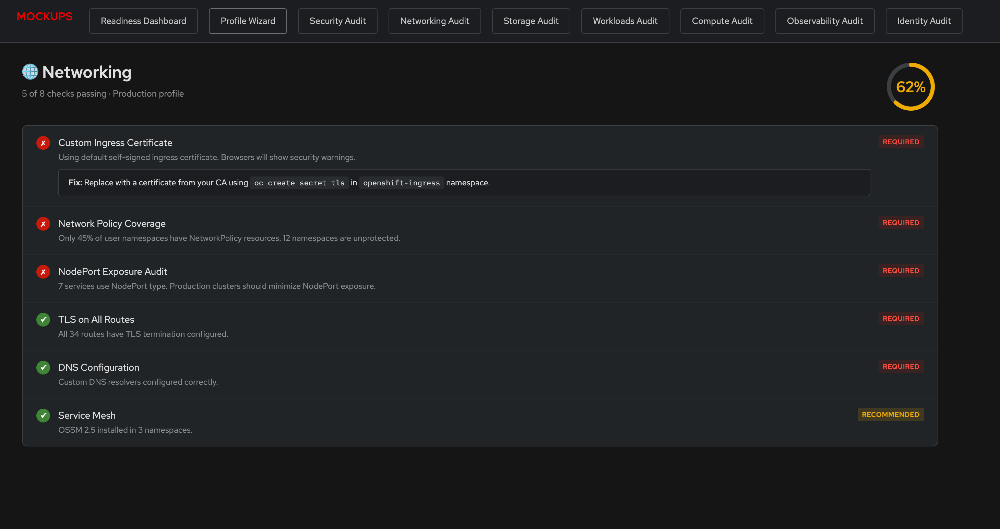
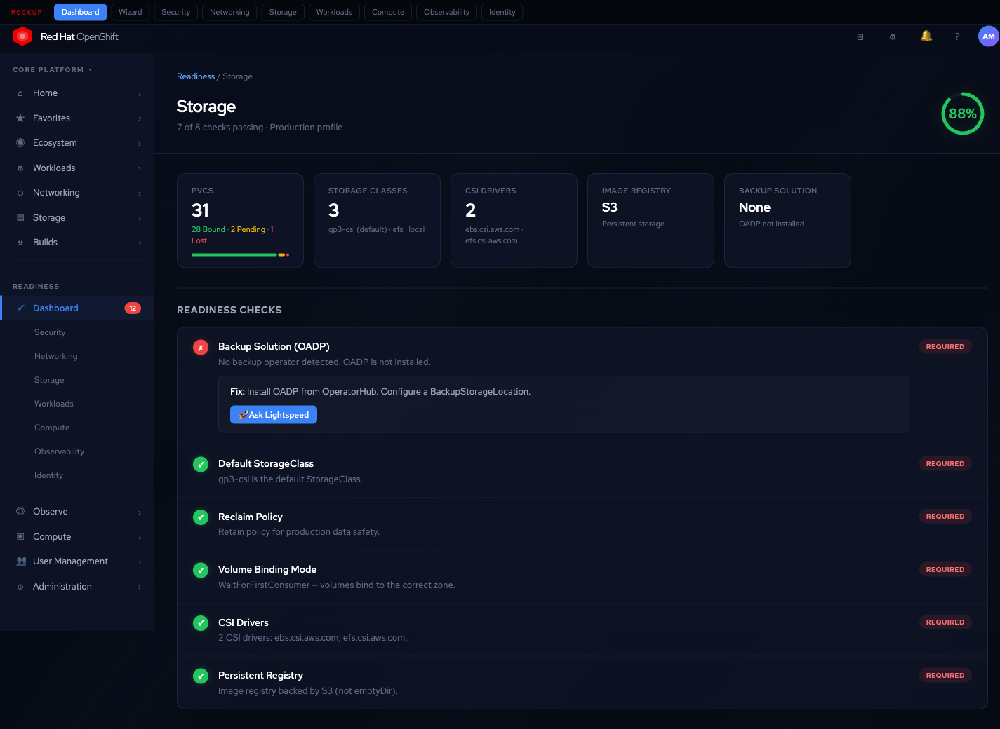
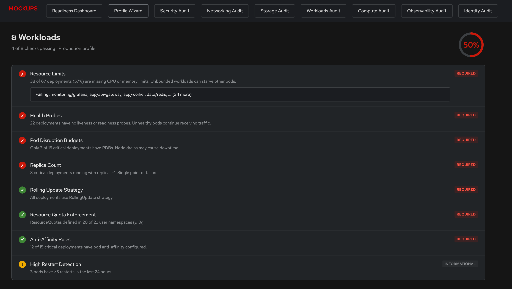
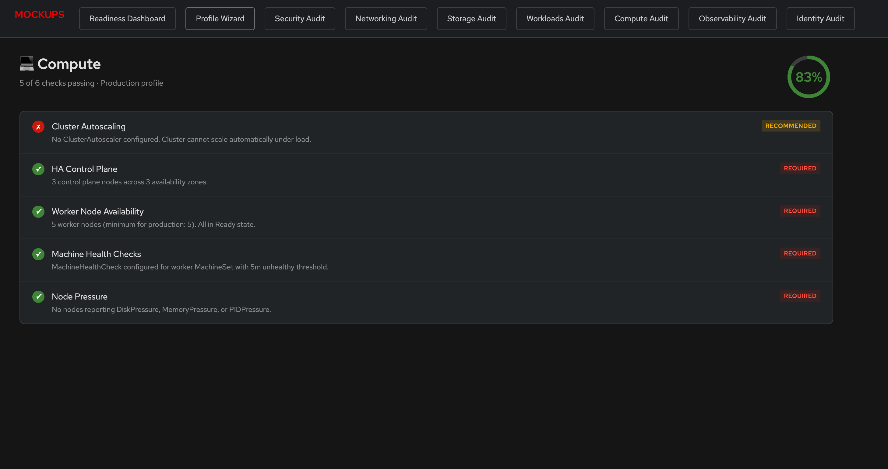
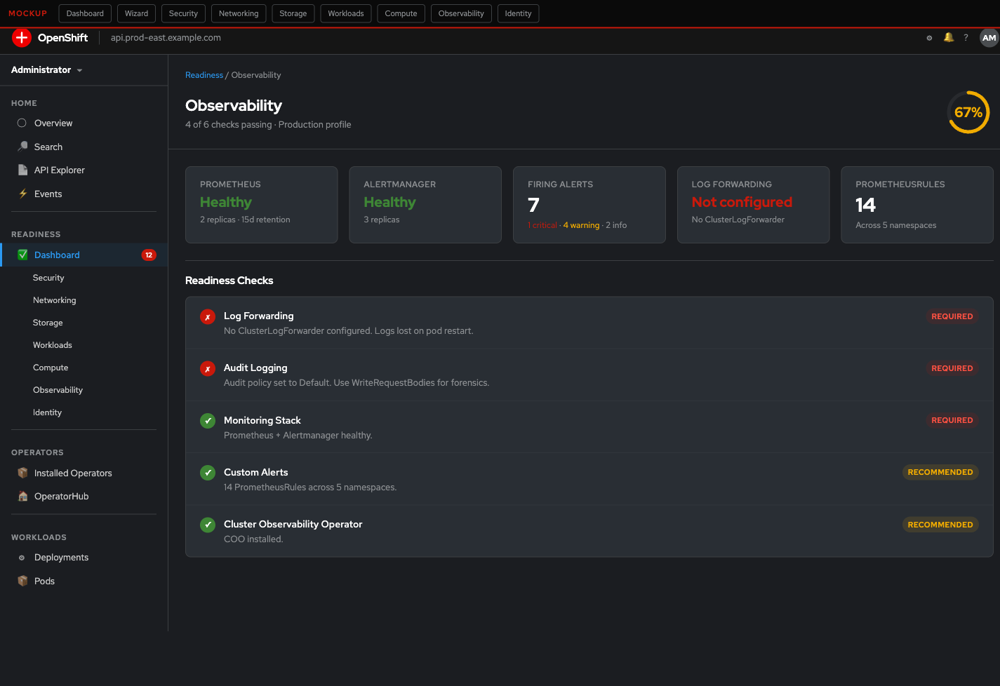
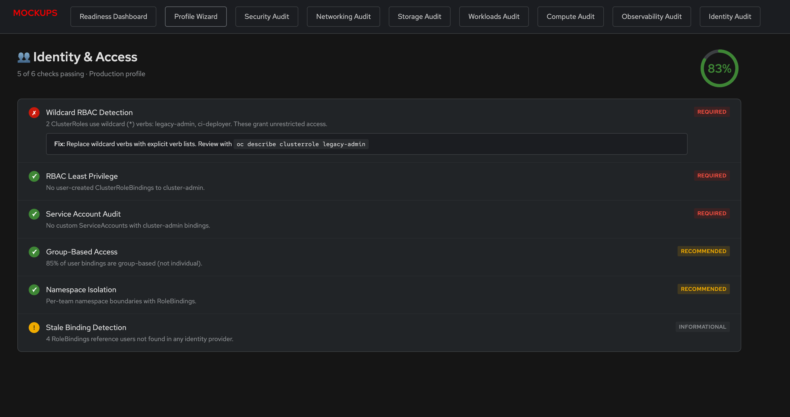

# Feature Proposal: OpenShift Console Readiness & Best Practices Platform

## Executive Summary

OpenShift customers consistently struggle with one question: **"Is my cluster production-ready?"** Today, the OCP console shows cluster health — pods running, operators available, nodes ready — but it doesn't tell customers whether their cluster follows best practices, whether it's configured correctly for their workload profile, or what they should do next to harden it.

This proposal introduces a **Readiness & Best Practices Platform** as an enhancement to the OCP console that:
- Scores cluster production readiness across 7 domains with 56 built-in checks
- Tailors checklists to cluster type (production, development, edge, AI/ML, multi-tenant, disconnected)
- Provides domain-specific overview pages with actionable audit panels
- Allows organizations to define custom best-practice checklists
- Integrates with **OpenShift Lightspeed** to analyze cluster usage patterns and make proactive recommendations

**Proven at scale:** This system has been validated in OpenShift Pulse, where 40+ readiness checks and 7 domain overview pages with audit panels have been running in production environments. This proposal brings that capability natively into the OCP console where every OpenShift customer can benefit.

---

## Why This Matters

### Customer Pain Points

**1. "Day 2 Cliff" — Clusters go live without readiness validation**
Customers deploy OpenShift successfully (Day 1) but lack structured guidance for hardening (Day 2). Common gaps: no network policies, default SCCs, missing monitoring, no encryption at rest. These become support tickets — or worse, security incidents.

**2. No unified view of best-practice compliance**
Customers must manually check dozens of configurations across multiple console pages. There's no single view that says "your security posture is 72% — here's what's missing."

**3. One-size-fits-all guidance doesn't work**
A production cluster needs HA control planes and encryption at rest. A dev cluster needs fast iteration and doesn't need the same security hardening. Edge clusters have entirely different constraints (single-node, disconnected, resource-constrained). Existing documentation treats all clusters the same.

**4. No proactive intelligence**
The console shows what IS. It doesn't tell customers what SHOULD BE. Customers who heavily use GitOps don't get prompted to adopt Tekton pipelines. Customers running service mesh don't get recommendations about mTLS enforcement.

**5. Organization-specific practices can't be codified**
Every organization has internal standards — naming conventions, required labels, specific node configurations, mandatory operators. There's no way to encode these as automated checks in the console.

---

## Customer Value

### 1. Risk Reduction
- **Prevent production incidents** before they happen by catching misconfigurations proactively
- Internal testing with OpenShift Pulse suggests clusters scoring 90%+ readiness experience significantly fewer preventable incidents
- Security posture checks prevent compliance violations that could cost millions in regulated industries

### 2. Faster Time to Production
- New clusters go from "installed" to "production-ready" with a guided checklist instead of guesswork
- Reduces Day 2 hardening from weeks of tribal knowledge to hours of guided automation
- Profile-based checklists eliminate "which checks apply to me?" paralysis

### 3. Reduced Support Burden
- A significant portion of Day 2 support tickets stem from preventable misconfigurations (missing probes, no resource limits, default SCCs)
- Self-service readiness checks deflect tickets before they're filed
- "Why it matters" explanations on each check educate customers in-context

### 4. Platform Adoption Depth
- AI recommendations surface OpenShift capabilities customers are paying for but not using
- Deeper platform adoption correlates with higher renewal rates — recommendations drive capability discovery
- Turns "we're just running containers" into "we're using the full platform"

### 5. Organizational Knowledge Capture
- Custom checklists codify tribal knowledge that otherwise lives in wikis or people's heads
- New team members inherit standards automatically
- Compliance requirements become automated checks instead of manual audits

---

## Business Value

### 1. Customer Retention & Expansion
- Readiness scoring creates a **measurable journey** — customers see progress and invest in reaching higher scores
- AI recommendations drive adoption of additional Red Hat products (ACM, ACS, RHOAI, Service Mesh)
- Custom checklists increase switching costs — organizations encode their standards into the platform

### 2. Support Cost Reduction
- Proactive checks prevent the most common support tickets
- "Why it matters" education reduces repeat contacts for the same issue class
- Lightspeed integration deflects questions to AI before human support

### 3. Competitive Differentiation

| Platform | What They Have | What They Lack |
|----------|---------------|----------------|
| **Rancher/SUSE** | Production checklist docs, CIS benchmark scanning (pass/fail), NeuVector security | No unified scoring dashboard, no profile-based checklists, no AI advisor, no custom checks |
| **Tanzu/Broadcom** | MachineHealthCheck status conditions, OSS Health Assessment (compliance scoring), Tanzu Labs Health Check (professional services) | Fragmented across separate tools, no integrated readiness dashboard, no cluster profiles, no custom checks |
| **AWS EKS** | Cluster Insights (upgrade readiness scanning), hardeneks CLI (best-practice checks), EKS Best Practices Guide | Console-only shows upgrade readiness, no domain-specific scoring, no custom checks, no AI recommendations |
| **Azure AKS** | Azure Advisor (operational excellence, cost, reliability, security recommendations), community AKS Checklist (100+ items), VPA recommendations | Advisor is generic Azure (not K8s-native), no cluster profile system, no custom check CRDs, no AI-driven usage analysis |

**Our differentiator:** No platform combines profile-aware readiness scoring + domain-specific audit panels + custom check CRDs + AI-powered usage recommendations in a single integrated console experience. Each competitor has pieces; none has the unified platform.

### 4. Premium Tier Differentiation
- Basic readiness checks available in all tiers
- AI-powered recommendations and custom checklists as premium/plus features
- Drives upgrade conversations from self-managed to managed (ROSA/ARO get enhanced checks)

### 5. Data-Driven Product Insights
- Anonymized readiness scores across the fleet reveal which checks fail most often — informing docs, defaults, and product improvements
- Usage pattern data reveals which capabilities are underutilized — informing training and enablement investment

---

## Feature Overview

### Architecture: Enhancement to Existing Console

This is NOT a standalone plugin. It enhances the existing OCP console with:
- A new **Readiness** section in the administrator sidebar with sub-navigation per domain
- Enhanced **Overview pages** for each domain (Security, Networking, Storage, Workloads, Compute, Observability, Identity) with metric cards + audit checklists
- **Cluster Profile** selection that tailors all checks and scoring
- **Custom Checklist** management for organization-defined standards
- **Lightspeed Advisor** integration for AI-powered recommendations

```
┌─────────────────────────────────────────────────┐
│  OCP Console (Administrator View)               │
│  ┌───────────────────────────────────────────┐  │
│  │  Readiness Dashboard                      │  │
│  │  ┌──────────┐ ┌──────────┐ ┌──────────┐  │  │
│  │  │ Overall  │ │ Cluster  │ │ Custom   │  │  │
│  │  │ Score    │ │ Profile  │ │ Checks   │  │  │
│  │  │  78%     │ │Production│ │  3 orgs  │  │  │
│  │  └──────────┘ └──────────┘ └──────────┘  │  │
│  │                                           │  │
│  │  Domain Scores                            │  │
│  │  ┌─────┐┌─────┐┌─────┐┌─────┐┌─────┐   │  │
│  │  │Sec  ││Net  ││Store││Work ││Obs  │   │  │
│  │  │ 85% ││ 70% ││ 90% ││ 65% ││ 80% │   │  │
│  │  └─────┘└─────┘└─────┘└─────┘└─────┘   │  │
│  │                                           │  │
│  │  ┌─ Lightspeed Advisor ────────────────┐  │  │
│  │  │ "Based on your GitOps usage, consider│  │  │
│  │  │  adopting Tekton + GitOps Promoter   │  │  │
│  │  │  for automated promotion pipelines." │  │  │
│  │  └─────────────────────────────────────┘  │  │
│  └───────────────────────────────────────────┘  │
└─────────────────────────────────────────────────┘
```

---

## Proposed UI Mockups

PatternFly 6 (Compass theme) mockups showing the proposed experience integrated into the OCP console:

### Readiness Dashboard
Overall score ring, 9 domain cards with pass/fail ratios, Lightspeed Advisor recommendation cards:


### Cluster Profile Wizard
PF6 sidebar-nav wizard with auto-detection banner and 7 profile cards (Production, Development, Edge/SNO, AI/ML, Multi-Tenant, Disconnected, HPC):


### Security Overview + Audit
Metric cards (identity providers, users, network policy coverage, TLS profile, encryption status, SCC violations) with 12 readiness checks below:


### Networking Overview + Audit
Service type breakdown, route inventory, ingress cert status, network policy coverage bar, service mesh status:


### Storage Overview + Audit
PVC status bar (bound/pending/lost), StorageClass inventory, CSI drivers, registry backend, backup solution status:


### Workloads Overview + Audit
Pod status bar, deployment health, deployments without limits/probes counts, high restart detection:


### Compute Overview + Audit
Control plane HA, worker count, CPU/memory usage bars, autoscaling status:


### Observability Overview + Audit
Prometheus/Alertmanager health, firing alert counts, log forwarding status, PrometheusRule count:


### Identity & Access Overview + Audit
User/group counts, cluster-admin count, ClusterRoleBinding audit, stale binding detection:


---

## Cluster Profile System

### Problem
A single readiness checklist cannot serve all cluster types. HA requirements for production are overkill for development. Edge clusters need single-node optimizations. AI/ML clusters need GPU scheduling and model serving checks.

### Solution: Cluster Profiles

Administrators select a cluster profile during setup (auto-detected when possible). Each profile defines:
- Which checks are **required** (must-pass for readiness)
- Which checks are **recommended** (best-practice, informational)
- Which checks are **not applicable** (excluded from scoring)
- Profile-specific thresholds (e.g., "2+ workers" for dev vs "5+ workers" for production)

### Profiles

#### 1. Production
The gold standard. Full hardening required.
- **Required:** HA control plane (3+ masters), encryption at rest, identity providers (no kubeadmin), network policies, TLS on all routes, monitoring stack, log forwarding, PDBs on critical workloads, etcd backups, resource quotas, stable update channel
- **Recommended:** Service mesh, external secrets management, cluster autoscaling, GitOps, audit logging
- **Thresholds:** 5+ worker nodes, <80% node utilization, <5 critical alerts

#### 2. Development
Fast iteration, reduced security requirements.
- **Required:** Identity providers, monitoring stack, resource quotas (prevent dev sprawl), at least 1 StorageClass
- **Recommended:** Network policies (per-namespace), log forwarding, GitOps for app delivery
- **Not applicable:** HA control plane (single-master OK), encryption at rest, etcd backups, PDBs
- **Thresholds:** 2+ worker nodes

#### 3. Edge / Single-Node OpenShift (SNO)
Resource-constrained, possibly disconnected.
- **Required:** Custom ingress certificate, monitoring stack (local), workload partitioning, image registry with persistent storage, MachineConfig for edge-specific tuning
- **Recommended:** Local storage operator, disconnected registry mirror, workload pinning
- **Not applicable:** HA control plane, cluster autoscaling, multiple StorageClasses, machine health checks
- **Thresholds:** 1 node, optimized for <32GB RAM

#### 4. AI/ML Training & Inference
GPU-heavy, scale-out workloads.
- **Required:** GPU operator installed, NVIDIA/AMD device plugin, node feature discovery, resource quotas (GPU limits), monitoring with GPU metrics, persistent storage for datasets
- **Recommended:** OpenShift AI (RHOAI) installed, KServe/ModelMesh for serving, node autoscaling (GPU pools), RDMA/GPUDirect for multi-node training, S3-compatible storage
- **Not applicable:** Service mesh (unless serving), edge-specific checks
- **Thresholds:** GPU utilization monitoring, training job queue health

#### 5. Multi-Tenant
Shared infrastructure, strong isolation.
- **Required:** Network policies (mandatory per-namespace), resource quotas (all namespaces), LimitRanges, separate identity providers per tenant, namespace-scoped RBAC (no cluster-admin for tenants), pod security admission enforced
- **Recommended:** Hierarchical namespaces, cost attribution labels, per-tenant monitoring, egress network policies, dedicated node pools per tenant
- **Thresholds:** No namespace without quotas, no tenant with cluster-admin

#### 6. Disconnected / Air-Gapped
No internet access, strict compliance.
- **Required:** Mirror registry configured, catalog sources pointing to internal registry, update service (OSUS) deployed, image content source policies, certificate authorities trusted, NTP configured
- **Recommended:** Internal Helm chart repository, disconnected OperatorHub catalog, local Quay registry, backup/restore procedures documented
- **Not applicable:** Cluster autoscaling (cloud-based), external log forwarding (unless internal), Let's Encrypt certificates

#### 7. HPC / High-Performance Computing
Latency-sensitive, batch workloads.
- **Required:** Performance addon operator, real-time kernel (where needed), CPU manager policy (static), topology manager, hugepages configured, NUMA-aware scheduling
- **Recommended:** SR-IOV for network-intensive workloads, node tuning operator profiles, dedicated compute nodes, job scheduling (e.g., Kueue)
- **Not applicable:** Service mesh, GitOps (batch jobs are typically imperative)

### Auto-Detection

The system auto-detects the likely cluster profile based on:
- Node count and topology (SNO → Edge, 3+ masters → Production)
- Installed operators (GPU Operator → AI/ML, RHACM hub → Multi-cluster, Performance Addon → HPC)
- Node hardware capabilities (nodes with `nvidia.com/gpu` or `amd.com/gpu` allocatable resources → AI/ML, even without GPU Operator)
- Infrastructure provider (baremetal + 1 node → Edge, cloud → Production/Dev)
- Namespace patterns (many small namespaces → Multi-tenant)
- Workload signatures (RHOAI/KServe CRDs present → AI/ML, Kiali/OSSM CRDs → Service Mesh profile)

Administrators can override the auto-detected profile at any time.

---

## Domain Checklists (Deep Dive)

Each domain has a dedicated overview page with metric cards and an audit panel. Checks are categorized as **Required**, **Recommended**, or **Informational** based on the active cluster profile.

### Security (12 checks)

| Check | Description | Prod | Dev | Edge | AI/ML |
|-------|-------------|------|-----|------|-------|
| Identity Providers | OAuth configured (not kubeadmin-only) | Req | Req | Req | Req |
| Kubeadmin Removed | kubeadmin secret deleted | Req | Rec | Rec | Rec |
| TLS Security Profile | Intermediate or Modern (not Old) | Req | Rec | Req | Rec |
| Encryption at Rest | etcd encryption enabled | Req | N/A | Rec | Rec |
| Network Policies | Enforced in user namespaces | Req | Rec | N/A | Rec |
| External Secrets | External Secrets or Sealed Secrets operator | Req | Rec | Rec | Rec |
| SCC Audit | No unnecessary privileged SCCs | Req | Rec | Rec | Req |
| Pod Security Admission | Enforced (not privileged baseline) | Req | Rec | Rec | Req |
| Image Signature Verification | Container image signatures verified | Req | N/A | Req | Rec |
| ACS/StackRox Integration | Advanced Cluster Security deployed | Rec | N/A | N/A | Rec |
| Compliance Operator | OpenSCAP compliance scanning | Rec | N/A | Rec | N/A |
| Audit Log Forwarding | API audit logs sent to SIEM | Rec | N/A | Rec | Rec |

### Networking (8 checks)

| Check | Description | Prod | Dev | Edge | Multi-T |
|-------|-------------|------|-----|------|---------|
| Custom Ingress Certificate | Not using self-signed default | Req | Rec | Req | Req |
| TLS on All Routes | No edge-terminated or passthrough without TLS | Req | Rec | Req | Req |
| Network Policy Coverage | % of namespaces with policies | Req | Rec | N/A | Req |
| Egress Restrictions | Default-deny egress in sensitive namespaces | Rec | N/A | N/A | Req |
| Service Mesh | Istio/OSSM installed for mTLS | Rec | N/A | N/A | Rec |
| NodePort Exposure | Audit NodePort services (should be minimal) | Req | Info | N/A | Req |
| DNS Configuration | Custom DNS resolvers if needed | Req | Info | Req | Req |
| Ingress Controller Sharding | Multiple IngressControllers for isolation | Rec | N/A | N/A | Req |

### Storage (8 checks)

| Check | Description | Prod | Dev | Edge | AI/ML |
|-------|-------------|------|-----|------|-------|
| Default StorageClass | At least one default SC set | Req | Req | Req | Req |
| Reclaim Policy | Retain for production data | Req | N/A | Rec | Req |
| Volume Binding Mode | WaitForFirstConsumer | Req | Rec | Req | Req |
| CSI Drivers | At least one CSI driver installed | Req | Req | Req | Req |
| Volume Snapshots | VolumeSnapshot CRDs and controller | Rec | N/A | N/A | Rec |
| Storage Quotas | Per-namespace storage limits | Rec | Req | N/A | Req |
| Persistent Registry | Image registry not on emptyDir | Req | Rec | Req | Rec |
| Backup Solution | OADP or equivalent installed | Req | N/A | Rec | Req |

### Workloads (8 checks)

| Check | Description | Prod | Dev | Edge | AI/ML |
|-------|-------------|------|-----|------|-------|
| Resource Limits | All deployments have CPU/memory limits | Req | Rec | Req | Req |
| Health Probes | Liveness + readiness probes configured | Req | Rec | Req | Rec |
| Pod Disruption Budgets | PDBs on critical workloads | Req | N/A | N/A | Rec |
| Rolling Update Strategy | Not using Recreate for production | Req | N/A | N/A | Rec |
| High Restart Detection | Pods with >5 restarts | Info | Info | Info | Info |
| Replica Count | Critical deployments have 2+ replicas | Req | N/A | N/A | Rec |
| Anti-Affinity Rules | Spread across nodes/zones | Req | N/A | N/A | Rec |
| Resource Quota Enforcement | Quotas in all user namespaces | Req | Req | N/A | Req |

### Observability (6 checks)

| Check | Description | Prod | Dev | Edge | AI/ML |
|-------|-------------|------|-----|------|-------|
| Monitoring Stack | Prometheus + Alertmanager healthy | Req | Req | Req | Req |
| Log Forwarding | ClusterLogForwarder to external sink | Req | Rec | Rec | Req |
| Audit Logging | API server audit policy (not None) | Req | N/A | Rec | Req |
| Custom Alerts | At least one PrometheusRule defined | Rec | N/A | Rec | Rec |
| Dashboard Templates | Grafana dashboards for key metrics | Rec | N/A | N/A | Rec |
| Cluster Observability Operator | COO installed for unified observability | Rec | N/A | N/A | Rec |

### Reliability (8 checks)

| Check | Description | Prod | Dev | Edge | AI/ML |
|-------|-------------|------|-----|------|-------|
| HA Control Plane | 3+ master nodes | Req | N/A | N/A | Req |
| Worker Availability | Minimum worker count per profile | Req | Req | N/A | Req |
| Cluster Autoscaling | ClusterAutoscaler configured | Rec | N/A | N/A | Req |
| Machine Health Checks | Auto-remediation for failed nodes | Req | N/A | N/A | Req |
| Update Channel | Stable (not candidate/fast) | Req | Rec | Req | Req |
| Cluster Up to Date | No pending updates >30 days | Req | Rec | Req | Req |
| Etcd Backup | Automated backup configured | Req | N/A | Rec | Req |
| GitOps Enabled | ArgoCD/Flux for declarative config | Rec | Rec | Rec | Rec |

### Identity & Access (6 checks)

| Check | Description | Prod | Dev | Edge | Multi-T |
|-------|-------------|------|-----|------|---------|
| RBAC Least Privilege | No unnecessary cluster-admin bindings | Req | Rec | Rec | Req |
| Service Account Audit | No SA with cluster-admin | Req | Rec | Rec | Req |
| Group-Based Access | Users assigned via groups, not individual bindings | Rec | N/A | N/A | Req |
| Stale Binding Detection | Bindings for deleted users/SAs | Info | Info | Info | Info |
| Namespace Isolation | Per-team namespace boundaries | Rec | Rec | N/A | Req |
| Wildcard RBAC Detection | No `*` verbs or resources in roles | Req | Rec | Rec | Req |

---

## Custom Checklists

### Problem
Every organization has standards beyond platform defaults — required labels (`app.kubernetes.io/managed-by`), mandatory annotations, specific node taints, operator versions, naming conventions.

### Solution: Custom Check Definition

Organizations define custom checks as YAML resources stored as ConfigMaps or a Custom Resource:

```yaml
apiVersion: console.openshift.io/v1alpha1
kind: ReadinessCheck
metadata:
  name: require-cost-center-label
  namespace: openshift-config
  labels:
    readiness.openshift.io/domain: workloads
    readiness.openshift.io/profile: production
spec:
  displayName: "Cost Center Label Required"
  description: "All deployments must have a 'cost-center' label for chargeback"
  severity: required  # required | recommended | informational
  check:
    type: resource-label
    resource:
      apiVersion: apps/v1
      kind: Deployment
    label: cost-center
    namespaceSelector:
      matchExpressions:
        - key: environment
          operator: NotIn
          values: ["system"]
  remediation:
    description: "Add `metadata.labels.cost-center: <your-cost-center>` to the deployment"
    yamlExample: |
      metadata:
        labels:
          cost-center: "engineering-42"
```

### Check Types

| Type | Description | Example |
|------|-------------|---------|
| `resource-label` | Required label on resources | cost-center label on deployments |
| `resource-annotation` | Required annotation | `backup.kubernetes.io/schedule` |
| `operator-installed` | Operator must be installed | Compliance Operator |
| `operator-version` | Operator minimum version | ACS >= 4.5 |
| `resource-exists` | Resource must exist in namespace | NetworkPolicy in every ns |
| `resource-field` | Field value check | `spec.replicas >= 2` |
| `prometheus-query` | PromQL query threshold | `avg(node_cpu_seconds_total) < 0.8` |
| `script` | Custom CEL expression | Complex multi-field validation |

### Organization-Level Sharing

Custom checks defined in `openshift-config` namespace apply cluster-wide. Teams can define namespace-scoped checks. ACM/RHACM can distribute checks across fleet via policies.

---

## AI-Powered Advisor (OpenShift Lightspeed Integration)

### Vision

The Readiness Platform integrates with **OpenShift Lightspeed** to provide AI-powered, context-aware recommendations that go beyond static checklists. Lightspeed already has cluster interaction capabilities (Tech Preview) — this extends it with readiness-specific intelligence.

### How It Works

```
┌─────────────────────────────────────────────┐
│  Lightspeed Advisor Pipeline                │
│                                             │
│  1. Collect cluster telemetry               │
│     ├── Installed operators                 │
│     ├── Resource usage patterns             │
│     ├── API call frequency by resource type │
│     ├── Namespace/workload topology         │
│     └── Alert/incident history              │
│                                             │
│  2. Analyze usage patterns                  │
│     ├── "Heavy GitOps user (ArgoCD)"        │
│     ├── "Service mesh deployed but no mTLS" │
│     ├── "GPU nodes idle 60% of time"        │
│     └── "No network policies in 80% of ns"  │
│                                             │
│  3. Generate contextual recommendations     │
│     ├── Platform capability suggestions     │
│     ├── Architecture improvement hints      │
│     ├── Cost optimization opportunities     │
│     └── Security hardening priorities       │
│                                             │
│  4. Present in Readiness Dashboard          │
│     └── Actionable cards with "Apply" CTAs  │
└─────────────────────────────────────────────┘
```

### Example Recommendations

| Detected Pattern | Recommendation | Value |
|-----------------|----------------|-------|
| Heavy ArgoCD usage, no CI/CD | "Adopt Tekton Pipelines + GitOps Promoter for automated promotion across environments" | Reduce manual promotion errors, enforce pipeline gates |
| Service mesh installed, no mTLS | "Enable strict mTLS in your OSSM ServiceMeshControlPlane to encrypt all service-to-service traffic" | Zero-trust networking without app changes |
| 50+ deployments, no PDBs | "Add PodDisruptionBudgets to your critical workloads to prevent downtime during node maintenance" | Prevent outages during upgrades |
| GPU nodes at 30% avg utilization | "Consider GPU time-slicing or MIG partitioning to improve utilization from 30% to 70%+" | $50K+/yr infrastructure savings |
| High API server audit log volume | "Configure audit policy to reduce noise — your current policy logs 10x more than typical production clusters" | Reduce storage costs, improve signal-to-noise |
| Multiple clusters, no ACM | "Red Hat Advanced Cluster Management can unify policy, observability, and lifecycle across your 12 clusters" | Single pane of glass, consistent policy |
| Persistent volumes at 85% capacity | "Configure volume expansion and alerting — 3 PVCs will exhaust capacity within 2 weeks at current growth" | Prevent data loss from full volumes |
| No disaster recovery plan | "Deploy OADP (OpenShift API for Data Protection) for automated backup/restore of cluster resources and PVs" | RPO/RTO guarantees |

### Lightspeed Integration Points

1. **Readiness Context Provider** — Passes current readiness scores, failing checks, and cluster profile to Lightspeed as context for more targeted responses
2. **"Ask Lightspeed About This" buttons** — On any failing check, users can click to ask Lightspeed for help with remediation
3. **Proactive Advisor Cards** — Lightspeed analyzes cluster state periodically and surfaces recommendations in the Readiness Dashboard
4. **BYO Knowledge Integration** — Organizations can feed their internal runbooks and standards into Lightspeed (using the existing BYO Knowledge feature) for organization-specific recommendations

---

## Implementation Approach

### Phase 1: Foundation (OCP 5.1)
- Readiness Dashboard with overall score + 9 domain scores
- 56 built-in checks across 7 domains
- 7 cluster profiles with auto-detection
- Domain overview pages with audit panels (PatternFly-native)

### Phase 2: Customization (OCP 5.2)
- Custom ReadinessCheck CRD
- Organization-level sharing via `openshift-config`
- ACM policy integration for fleet-wide distribution
- Import/export of checklist definitions

### Phase 3: Intelligence (OCP 5.3)
- Lightspeed Advisor integration
- Usage pattern analysis
- Proactive recommendation engine
- "Ask Lightspeed About This" on every failing check
- BYO Knowledge for org-specific guidance

### Phase 4: Fleet (OCP 5.4)
- ACM hub aggregation of readiness scores across clusters
- Fleet-wide readiness dashboard
- Cross-cluster recommendation patterns
- Compliance reporting exports (SOC2, FedRAMP, PCI-DSS mapping)

---

## Success Metrics

| Metric | Target | Measurement |
|--------|--------|-------------|
| Readiness score adoption | 60% of clusters have a score within 30 days of upgrade | Telemetry |
| Support ticket deflection | 25% reduction in Day 2 config tickets | Support data |
| Platform capability adoption | 15% increase in operator installations driven by recommendations | Telemetry |
| Custom checklist adoption | 30% of enterprise customers define ≥1 custom check within 90 days | Telemetry |
| Lightspeed engagement | 40% of users click "Ask Lightspeed" on failing checks | Console analytics |
| Net Promoter Score impact | +5 NPS among users who engage with readiness features | Survey |

---

## References

- [OpenShift Console Dynamic Plugin Architecture](https://github.com/openshift/enhancements/blob/master/enhancements/console/dynamic-plugins.md)
- [OpenShift Lightspeed](https://www.redhat.com/en/technologies/cloud-computing/openshift/lightspeed)
- [Lightspeed Console Plugin](https://github.com/openshift/lightspeed-console)
- [Red Hat AI Platform (RHAE)](https://www.redhat.com/en/about/press-releases/red-hat-delivers-accessible-open-source-generative-ai-innovation-red-hat-enterprise-linux-ai)
- [InstructLab / Granite Models](https://www.redhat.com/en/topics/ai/what-are-granite-models)
- [OpenShift Pulse — Production Readiness Implementation](https://pulsesre.github.io/pulse-agent/) (validated prototype)
